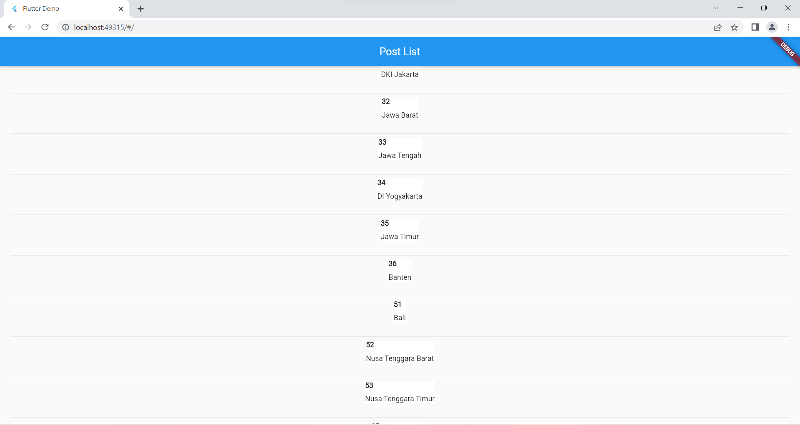

1. Pertama, kita mengimpor paket-paket yang diperlukan:
 - `package:flutter/material.dart` adalah paket yang menyediakan komponen dan widget yang 
digunakan dalam membangun antarmuka pengguna Flutter.
 - `package:http/http.dart` adalah paket yang digunakan untuk membuat permintaan HTTP ke API.
 - `dart:convert` adalah paket yang berisi utilitas untuk mengonversi data ke dan dari format JSON.
2. Kemudian, kita mendefinisikan sebuah kelas `ListQuote` yang merupakan turunan dari 
`StatelessWidget`. Kelas ini akan menjadi tampilan utama yang menampilkan daftar kode pos.
3. Di dalam kelas `ListQuote`, kita mendeklarasikan variabel `apiUrl` yang berisi URL API yang akan 
diakses.
4. Pada constructor `ListQuote`, kita menggunakan sintaksis const untuk memberikan nilai default 
pada properti `key`.
5. Selanjutnya, kita mendefinisikan metode `_fetchListQuotes()` yang merupakan metode 
asynchronous untuk mengambil data dari API. Metode ini menggunakan pustaka `http` untuk 
membuat permintaan GET ke URL API dan menguraikan respons JSON yang diterima.
6. Pada metode `build()`, kita menggunakan `Scaffold` sebagai kerangka tampilan. `Scaffold` 
merupakan sebuah widget yang menyediakan struktur dasar untuk tampilan dengan AppBar, body, 
dan sebagainya.
7. Di dalam body `Scaffold`, kita menggunakan `FutureBuilder` untuk menangani proses asinkron 
dalam mengambil data dari API. `FutureBuilder` mengambil dua argumen utama: future (yang 
merupakan hasil dari `_fetchListQuotes()`) dan builder (yang membangun tampilan berdasarkan 
status future).
8. Jika snapshot dari future memiliki data (snapshot.hasData), maka kita menggunakan 
`ListView.builder` untuk membuat daftar item dengan membangun setiap item menggunakan 
widget `ListTile`. Setiap `ListTile` menampilkan informasi seperti kode pos, kelurahan, dan 
kecamatan. Item-item tersebut dibungkus dalam widget `Card` untuk memberikan tampilan yang 
konsisten.
9. Jika snapshot belum memiliki data (ketika future masih dalam proses atau mengalami error), kita 
menampilkan widget `CircularProgressIndicator` sebagai indikator proses.
Kode tersebut dapat digunakan untuk membuat tampilan Flutter yang menampilkan daftar namanama daerah berdasarkan data dari API Kode Pos.
Output :
Link Git Hub:
https://github.com/ArjunSyah/UAS_MOBILE_API.git

### Tampilan Halaman list quote

